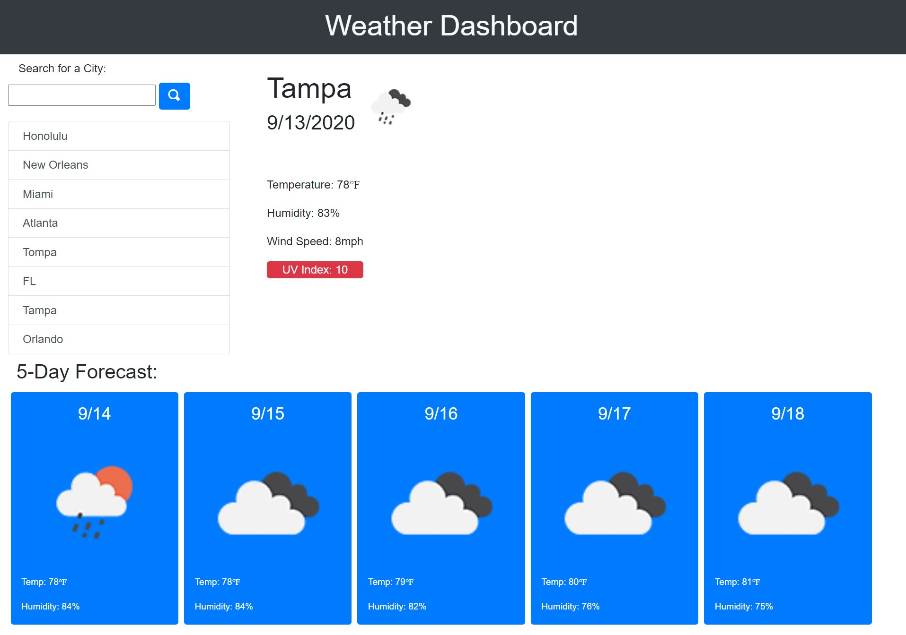

# Weather Dashboard

## Description 
A web application that allows users to search by city name and retrieve current weather information along with a 5-day weather forecast. Forecasts include weather data along with a color coded UV index and icons representing the weather conditions.
 
## Built With
* HTML
* CSS
* JavaScript
* Bootstrap
* jQuery
* OpenWeather API

## Table of Contents 
* [Usage](#usage) 
* [Contributing](#contributing)

## Link to Deployed Application
* [Weather Dashboard](https://mplumer.github.io/weather-dash/)

##Screenshots

### Contributing
Weather Dashboard is an open source project built from starter code, cloned from the Vanderbilt University Coding Bootcamp. Anyone is encouraged to contribute by cloning or forking the code and working to improve its function and versatility.
    
##### Interested in other projects from this developer? Visit the following GitHub page:
https://github.com/mplumer
    
##### Send any questions to the following email address:
maxplumer12@gmail.com
